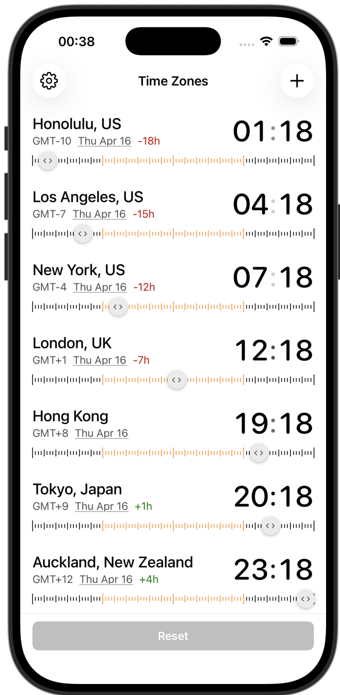

# Time Zones (iOS)

An iOS app for viewing multiple timezones at a glance — the iPhone companion to [TimeZonesMacOS](https://github.com/m-tse/TimeZonesMacOS).

[Download on the App Store](https://apps.apple.com/app/time-zone-visualizer/id6761193852)



## Why

Most timezone apps just show you the current time in different cities. That's not very useful — you can Google that. What you actually need is to answer questions like "if I schedule a call for 3pm my time, what time is that for them?" or "what time was it in Tokyo when that incident fired at 2am?" This app lets you drag a time ruler and see all your cities update simultaneously, so you can scrub forward or backward through the day and instantly see the answer.

It's also designed to be dead simple to read. Day and night hours are visually distinct, date changes are color-coded, and hour deltas are shown relative to whichever city you tap — no mental math required.

## Features

- **Multiple timezones** — add cities from a curated list with search
- **Draggable time ruler** — scrub through the full 24 hours, updating all cities simultaneously
- **Day/night visualization** — timeline ticks are light for daytime hours and dark for nighttime
- **Reference city** — tap any city to set it as your reference point; hour deltas adjust accordingly
- **Rename cities** — long-press any city to give it a custom alias
- **Jump to date** — tap the date on any row to open a date picker and see all timezones on a future or past date
- **Date indicators** — each city shows its current date, colored red if behind your reference city's day, green if ahead
- **Hour delta** — shows the offset from your reference city (e.g. `-6h`, `+1h`)
- **Auto-sorted** — cities are always ordered by UTC offset (west to east)
- **Swipe to remove** — swipe left on any city to remove it

## Requirements

- iOS 16.0 or later

## App Store Release (CLI)

### Constants

- **Bundle ID**: `com.matthewtse.timezones`
- **Team ID**: `2TMRXZB6JT`
- **App Store Connect API Key ID**: `754SDLX2C5` (Admin role — required for cloud-signed distribution certificates)
- **App Store Connect Issuer ID**: `c39330f9-3f5e-44d6-abe8-5e3a76d7e014`
- **Private key location**: `~/.appstoreconnect/private_keys/AuthKey_754SDLX2C5.p8`

The Admin role on the API key is what lets `xcodebuild -allowProvisioningUpdates` create/renew the iOS Distribution certificate without manual Xcode steps. A non-Admin key fails with "Cloud signing permission error / No signing certificate iOS Distribution found".

### Release steps

1. **Bump version** in `TimeZonesiPhoneApp.xcodeproj/project.pbxproj` — both Debug and Release configs:
   - `MARKETING_VERSION` (e.g. `1.2` → `1.3`)
   - `CURRENT_PROJECT_VERSION` — must increase every upload (App Store Connect rejects duplicates)

2. **Archive**:
   ```bash
   rm -rf build/TimeZonesiPhoneApp.xcarchive build/export
   xcodebuild -project TimeZonesiPhoneApp.xcodeproj \
     -scheme TimeZonesiPhoneApp -configuration Release \
     -destination 'generic/platform=iOS' \
     -archivePath build/TimeZonesiPhoneApp.xcarchive archive
   ```

3. **Export + upload** (`ExportOptions.plist` has `destination: upload`, so this single command both exports the IPA and uploads it to App Store Connect):
   ```bash
   xcodebuild -exportArchive \
     -archivePath build/TimeZonesiPhoneApp.xcarchive \
     -exportOptionsPlist ExportOptions.plist \
     -exportPath build/export \
     -allowProvisioningUpdates \
     -authenticationKeyPath ~/.appstoreconnect/private_keys/AuthKey_754SDLX2C5.p8 \
     -authenticationKeyID 754SDLX2C5 \
     -authenticationKeyIssuerID c39330f9-3f5e-44d6-abe8-5e3a76d7e014
   ```

4. **Commit, tag, push**:
   ```bash
   git commit -am "Bump version to X.Y (build N)"
   git tag vX.Y && git push origin main vX.Y
   ```

5. **In App Store Connect web UI**: wait for the build to finish processing (5-15 min, you'll get an email), then create a new version, fill in "What's New" release notes, attach the build, and submit for review.

### Pre-release gotchas

- **Agreements**: if `App Store Connect → Business → Agreements` shows any agreement that isn't `Active`, accept it first (`FORBIDDEN.REQUIRED_AGREEMENTS_MISSING_OR_EXPIRED`).
- **DSA / EU trader compliance**: if `App Store Connect → Business` shows a red Digital Services Act banner, complete it before uploading.

## Privacy

See [PRIVACY_POLICY.md](PRIVACY_POLICY.md).
